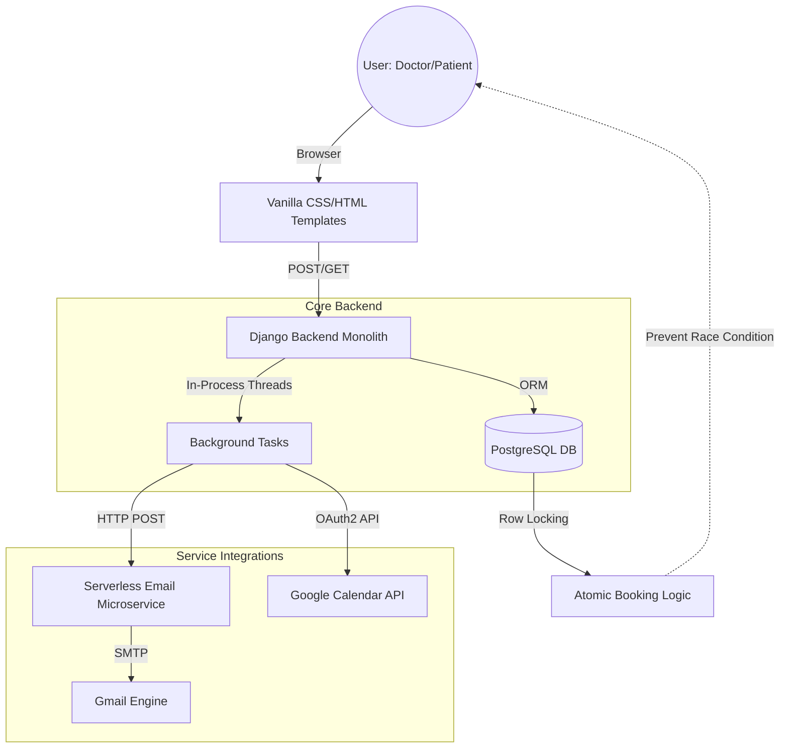

# System Architecture Design

This diagram illustrates the flow of data and the decoupling of services within the Mini Hospital Management System.

## Key Architectural Components:

1. **The Monolith (Django):** Handles business logic, authentication, and view rendering.
2. **The Database (PostgreSQL):** Uses ACID-compliant transactions and row-level locking (`select_for_update`) to manage concurrent booking attempts.
3. **The Microservice (Serverless/Node.js):** A decoupled service responsible solely for email rendering and delivery. This ensures the main app remains fast and responsive.
4. **Third-Party Sync:** Bi-directional integration with Google via OAuth2 for automated calendar management.
