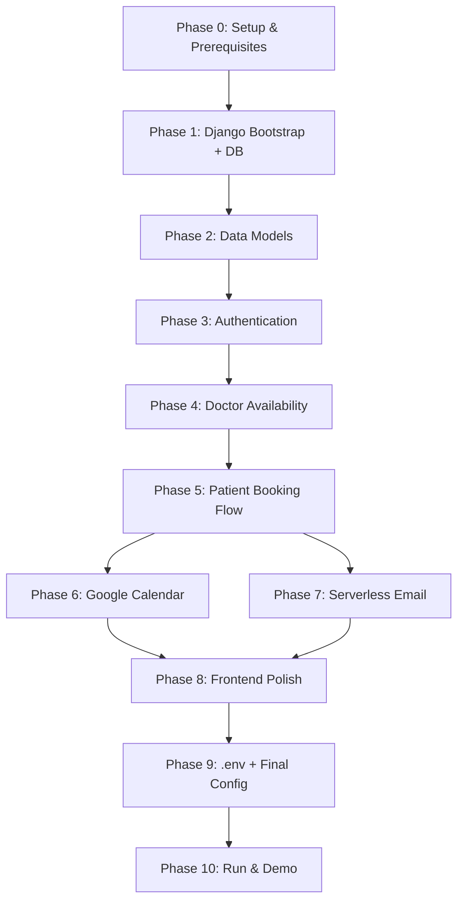

# 🏥 Mini Hospital Management System — Implementation Plan

## Overview

| Layer | Technology |
|---|---|
| Backend | Django 5.x |
| Database | PostgreSQL (local) |
| ORM | Django ORM |
| Auth | Django's built-in auth (session-based) |
| Calendar | Google Calendar API v3 (OAuth2) |
| Email | AWS Lambda (Serverless Framework) via HTTP |
| Local Dev | `serverless-offline` plugin |

---

## Phase 0 — Environment Setup

### 0.1 Install Prerequisites

```
Python 3.11+
PostgreSQL 15+ (local install)
Node.js 18+ (for Serverless Framework)
npm install -g serverless
pip install django psycopg2-binary djangorestframework google-auth google-auth-oauthlib google-api-python-client python-dotenv
```

### 0.2 Project Folder Layout

```
hms/
├── manage.py
├── .env
├── requirements.txt
├── hms_project/          ← Django project settings
│   ├── settings.py
│   ├── urls.py
│   └── wsgi.py
├── accounts/             ← Auth + user roles
├── doctors/              ← Availability slots management
├── patients/             ← Booking logic + calendar integration
├── core/                 ← Shared utilities (calendar helper, email caller)
├── templates/
│   ├── base.html
│   ├── accounts/
│   ├── doctors/
│   └── patients/
└── static/

serverless-email/         ← Separate mini-project (sibling folder)
├── serverless.yml
├── handler.py
├── requirements.txt
└── .env
```

---

## Phase 1 — Django Project Bootstrap

### 1.1 Create Django Project

```bash
django-admin startproject hms_project hms
cd hms
python manage.py startapp accounts
python manage.py startapp doctors
python manage.py startapp patients
python manage.py startapp core
```

### 1.2 PostgreSQL Database Setup

```sql
CREATE DATABASE hms_db;
CREATE USER hms_user WITH PASSWORD 'yourpassword';
GRANT ALL PRIVILEGES ON DATABASE hms_db TO hms_user;
```

`settings.py`:
```python
DATABASES = {
    'default': {
        'ENGINE': 'django.db.backends.postgresql',
        'NAME': 'hms_db',
        'USER': 'hms_user',
        'PASSWORD': 'yourpassword',
        'HOST': 'localhost',
        'PORT': '5432',
    }
}
```

### 1.3 Custom User Model

> [!IMPORTANT]
> Define custom user **before** first migration. This cannot be changed easily later.

`accounts/models.py`:
```python
from django.contrib.auth.models import AbstractUser
from django.db import models

class User(AbstractUser):
    ROLE_CHOICES = [('doctor', 'Doctor'), ('patient', 'Patient')]
    role = models.CharField(max_length=10, choices=ROLE_CHOICES)
    # Google Calendar token storage
    google_token = models.JSONField(null=True, blank=True)

AUTH_USER_MODEL = 'accounts.User'  # in settings.py
```

---

## Phase 2 — Data Models

### 2.1 Doctor App Models (`doctors/models.py`)

```python
from django.db import models
from django.conf import settings

class AvailabilitySlot(models.Model):
    doctor = models.ForeignKey(
        settings.AUTH_USER_MODEL,
        on_delete=models.CASCADE,
        related_name='availability_slots',
        limit_choices_to={'role': 'doctor'}
    )
    date = models.DateField()
    start_time = models.TimeField()
    end_time = models.TimeField()
    is_booked = models.BooleanField(default=False)

    class Meta:
        unique_together = ('doctor', 'date', 'start_time')
        ordering = ['date', 'start_time']

    def __str__(self):
        return f"Dr.{self.doctor.get_full_name()} | {self.date} {self.start_time}-{self.end_time}"
```

### 2.2 Patient App Models (`patients/models.py`)

```python
from django.db import models
from django.conf import settings
from doctors.models import AvailabilitySlot

class Appointment(models.Model):
    STATUS_CHOICES = [
        ('confirmed', 'Confirmed'),
        ('cancelled', 'Cancelled'),
    ]
    patient = models.ForeignKey(
        settings.AUTH_USER_MODEL,
        on_delete=models.CASCADE,
        related_name='appointments',
        limit_choices_to={'role': 'patient'}
    )
    slot = models.OneToOneField(
        AvailabilitySlot,
        on_delete=models.CASCADE,
        related_name='appointment'
    )
    status = models.CharField(max_length=20, choices=STATUS_CHOICES, default='confirmed')
    doctor_calendar_event_id = models.CharField(max_length=255, blank=True)
    patient_calendar_event_id = models.CharField(max_length=255, blank=True)
    created_at = models.DateTimeField(auto_now_add=True)
```

> [!NOTE]
> `OneToOneField` on slot guarantees only one appointment per slot at the DB level (in addition to code-level checks).

---

## Phase 3 — Authentication

### 3.1 Sign Up Views (`accounts/views.py`)

- Separate sign-up forms for Doctor and Patient (or a unified form with role selection).
- On successful sign-up:
  1. Hash password via `set_password()`.
  2. Save user to DB.
  3. **Call Serverless Email Service** with action `SIGNUP_WELCOME`.
  4. Log the user in and redirect to their dashboard.

### 3.2 URLs

```python
# accounts/urls.py
urlpatterns = [
    path('signup/', views.signup_view, name='signup'),
    path('login/', views.login_view, name='login'),
    path('logout/', views.logout_view, name='logout'),
]
```

### 3.3 Role-Based Access Control

Custom decorators and mixins:
```python
# core/decorators.py
from functools import wraps
from django.shortcuts import redirect

def doctor_required(view_func):
    @wraps(view_func)
    def wrapper(request, *args, **kwargs):
        if not request.user.is_authenticated or request.user.role != 'doctor':
            return redirect('login')
        return view_func(request, *args, **kwargs)
    return wrapper

def patient_required(view_func):
    # same pattern
    ...
```

---

## Phase 4 — Doctor Availability Management

### 4.1 Doctor Dashboard Features

| Feature | URL | View |
|---|---|---|
| View my slots | `/doctor/dashboard/` | `DoctorDashboardView` |
| Add a new slot | `/doctor/slots/add/` | `AddSlotView` |
| Edit a slot | `/doctor/slots/<id>/edit/` | `EditSlotView` |
| Delete a slot | `/doctor/slots/<id>/delete/` | `DeleteSlotView` |

### 4.2 Add Slot Form (`doctors/forms.py`)

```python
from django import forms
from .models import AvailabilitySlot

class AvailabilitySlotForm(forms.ModelForm):
    class Meta:
        model = AvailabilitySlot
        fields = ['date', 'start_time', 'end_time']
        widgets = {
            'date': forms.DateInput(attrs={'type': 'date'}),
            'start_time': forms.TimeInput(attrs={'type': 'time'}),
            'end_time': forms.TimeInput(attrs={'type': 'time'}),
        }

    def clean(self):
        cleaned = super().clean()
        if cleaned.get('start_time') >= cleaned.get('end_time'):
            raise forms.ValidationError("End time must be after start time.")
        return cleaned
```

### 4.3 Doctor View — Bookings

- Doctor's dashboard also shows all `Appointment` objects linked to their slots.
- Only shows: patient name, date, time, status.

---

## Phase 5 — Patient Booking Flow

### 5.1 Booking Steps (UI)

```
1. /patient/doctors/               → List all doctors
2. /patient/doctors/<id>/slots/    → List available (future, not booked) slots for that doctor
3. /patient/book/<slot_id>/        → Confirm booking page
4. POST → booking logic → success page
```

### 5.2 Race Condition Handling (`patients/views.py`)

> [!IMPORTANT]
> Use `select_for_update()` with a transaction to prevent double-booking.

```python
from django.db import transaction
from doctors.models import AvailabilitySlot
from .models import Appointment

def book_slot(request, slot_id):
    with transaction.atomic():
        slot = AvailabilitySlot.objects.select_for_update().get(id=slot_id)
        if slot.is_booked:
            # Return error — slot already taken
            return render(request, 'patients/slot_taken.html')
        
        slot.is_booked = True
        slot.save()

        appointment = Appointment.objects.create(
            patient=request.user,
            slot=slot,
            status='confirmed'
        )

    # Outside transaction — trigger async actions
    trigger_google_calendar(appointment)
    call_email_service('BOOKING_CONFIRMATION', appointment)

    return redirect('booking_success', pk=appointment.pk)
```

### 5.3 Patient Dashboard

- Shows all confirmed/past appointments.
- Each appointment shows doctor name, date, time, status.

---

## Phase 6 — Google Calendar Integration

### 6.1 Overview

```
User logs in with Google OAuth2 → Token stored in User.google_token (JSON)
On booking → Django backend creates Google Calendar event using stored token
```

### 6.2 Setup

1. Create a project in [Google Cloud Console](https://console.cloud.google.com).
2. Enable **Google Calendar API**.
3. Create **OAuth 2.0 Client ID** (Web Application type).
4. Set redirect URI: `http://localhost:8000/oauth/callback/`
5. Download `credentials.json`.

### 6.3 OAuth Flow (`core/google_auth.py`)

```python
from google_auth_oauthlib.flow import Flow
from google.oauth2.credentials import Credentials
from googleapiclient.discovery import build

SCOPES = ['https://www.googleapis.com/auth/calendar.events']

def get_flow():
    return Flow.from_client_secrets_file(
        'credentials.json',
        scopes=SCOPES,
        redirect_uri='http://localhost:8000/oauth/callback/'
    )

def get_calendar_service(token_dict):
    creds = Credentials(**token_dict)
    return build('calendar', 'v3', credentials=creds)
```

### 6.4 Create Calendar Event (`core/calendar_helper.py`)

```python
def create_appointment_event(service, title, start_dt, end_dt, description=''):
    event = {
        'summary': title,
        'description': description,
        'start': {'dateTime': start_dt.isoformat(), 'timeZone': 'Asia/Kolkata'},
        'end':   {'dateTime': end_dt.isoformat(),   'timeZone': 'Asia/Kolkata'},
    }
    created = service.events().insert(calendarId='primary', body=event).execute()
    return created['id']

def trigger_google_calendar(appointment):
    slot = appointment.slot
    doctor = slot.doctor
    patient = appointment.patient

    from datetime import datetime, timezone as tz
    start_dt = datetime.combine(slot.date, slot.start_time)
    end_dt   = datetime.combine(slot.date, slot.end_time)

    # Doctor's calendar
    if doctor.google_token:
        service = get_calendar_service(doctor.google_token)
        event_id = create_appointment_event(
            service,
            title=f"Appointment with {patient.get_full_name()}",
            start_dt=start_dt, end_dt=end_dt
        )
        appointment.doctor_calendar_event_id = event_id

    # Patient's calendar
    if patient.google_token:
        service = get_calendar_service(patient.google_token)
        event_id = create_appointment_event(
            service,
            title=f"Appointment with Dr. {doctor.get_full_name()}",
            start_dt=start_dt, end_dt=end_dt
        )
        appointment.patient_calendar_event_id = event_id

    appointment.save()
```

### 6.5 Django URLs for OAuth

```python
# core/urls.py
urlpatterns = [
    path('oauth/start/', views.google_oauth_start, name='oauth_start'),
    path('oauth/callback/', views.google_oauth_callback, name='oauth_callback'),
]
```

---

## Phase 7 — Serverless Email Service

> This is a **separate project** in the `serverless-email/` directory.

### 7.1 Project Structure

```
serverless-email/
├── serverless.yml
├── handler.py
├── requirements.txt   ← just "requests" for internal libs
└── .env               ← SMTP credentials
```

### 7.2 `serverless.yml`

```yaml
service: hms-email-service
frameworkVersion: '3'

provider:
  name: aws
  runtime: python3.11
  region: us-east-1
  environment:
    SMTP_HOST: smtp.gmail.com
    SMTP_PORT: 587
    SMTP_USER: ${env:SMTP_USER}
    SMTP_PASS: ${env:SMTP_PASS}
    FROM_EMAIL: ${env:SMTP_USER}

functions:
  sendEmail:
    handler: handler.send_email
    events:
      - http:
          path: /send-email
          method: post
          cors: true

plugins:
  - serverless-offline

custom:
  serverless-offline:
    httpPort: 4000
```

### 7.3 `handler.py`

```python
import json
import smtplib
import os
from email.mime.text import MIMEText
from email.mime.multipart import MIMEMultipart

TEMPLATES = {
    'SIGNUP_WELCOME': {
        'subject': 'Welcome to HMS!',
        'body': lambda data: f"""
Hi {data.get('name')},

Welcome to the Hospital Management System!
Your account has been created successfully as a {data.get('role')}.

Best regards,
HMS Team
""",
    },
    'BOOKING_CONFIRMATION': {
        'subject': 'Appointment Confirmed',
        'body': lambda data: f"""
Hi {data.get('patient_name')},

Your appointment with Dr. {data.get('doctor_name')} is confirmed.
Date: {data.get('date')}
Time: {data.get('start_time')} - {data.get('end_time')}

Please be on time.

Best regards,
HMS Team
""",
    },
}

def send_email(event, context):
    try:
        body = json.loads(event.get('body', '{}'))
        action = body.get('action')
        to_email = body.get('to_email')
        data = body.get('data', {})

        if action not in TEMPLATES:
            return {'statusCode': 400, 'body': json.dumps({'error': 'Unknown action'})}

        template = TEMPLATES[action]
        subject = template['subject']
        message_body = template['body'](data)

        msg = MIMEMultipart()
        msg['From'] = os.environ['FROM_EMAIL']
        msg['To'] = to_email
        msg['Subject'] = subject
        msg.attach(MIMEText(message_body, 'plain'))

        with smtplib.SMTP(os.environ['SMTP_HOST'], int(os.environ['SMTP_PORT'])) as server:
            server.starttls()
            server.login(os.environ['SMTP_USER'], os.environ['SMTP_PASS'])
            server.sendmail(os.environ['FROM_EMAIL'], to_email, msg.as_string())

        return {'statusCode': 200, 'body': json.dumps({'message': 'Email sent successfully'})}

    except Exception as e:
        return {'statusCode': 500, 'body': json.dumps({'error': str(e)})}
```

### 7.4 Calling from Django (`core/email_service.py`)

```python
import requests
import os

EMAIL_SERVICE_URL = os.getenv('EMAIL_SERVICE_URL', 'http://localhost:4000/send-email')

def call_email_service(action: str, to_email: str, data: dict):
    try:
        response = requests.post(
            EMAIL_SERVICE_URL,
            json={'action': action, 'to_email': to_email, 'data': data},
            timeout=5
        )
        return response.json()
    except Exception as e:
        print(f"[Email Service] Failed: {e}")
        return None
```

### 7.5 Running Locally

```bash
cd serverless-email
npm install --save-dev serverless-offline
serverless offline
# → API available at http://localhost:4000/send-email
```

---

## Phase 8 — Frontend / Templates

### 8.1 Base Template (`templates/base.html`)

- Bootstrap 5 or custom CSS
- Navigation: Login / Signup / Dashboard / Logout
- Role-aware nav items (use `request.user.role` in templates)

### 8.2 Key Template Pages

| Template | Purpose |
|---|---|
| `accounts/signup.html` | Unified sign up with role selector |
| `accounts/login.html` | Login form |
| `doctors/dashboard.html` | Doctor's slot list + booking summary |
| `doctors/slot_form.html` | Add/edit slot |
| `patients/dashboard.html` | Patient's appointments |
| `patients/doctor_list.html` | Browse all doctors |
| `patients/slot_list.html` | Available slots for a doctor |
| `patients/book_confirm.html` | Confirm booking |

---

## Phase 9 — Environment Variables (`.env`)

```
# Django
SECRET_KEY=your-django-secret-key
DEBUG=True
DB_NAME=hms_db
DB_USER=hms_user
DB_PASSWORD=yourpassword
DB_HOST=localhost
DB_PORT=5432

# Google OAuth
GOOGLE_CLIENT_ID=...
GOOGLE_CLIENT_SECRET=...

# Serverless Email endpoint
EMAIL_SERVICE_URL=http://localhost:4000/send-email

# serverless-email/.env (separate)
SMTP_USER=youremail@gmail.com
SMTP_PASS=your-app-password
```

> [!CAUTION]
> For Gmail SMTP, use an **App Password**, not your regular password. Enable 2FA and generate an App Password from Google Account settings.

---

## Phase 10 — Migrations & Running Locally

```bash
# HMS Django App
cd hms
python manage.py makemigrations accounts doctors patients
python manage.py migrate
python manage.py createsuperuser
python manage.py runserver

# Serverless Email Service (separate terminal)
cd serverless-email
serverless offline
```

---

## Build Order (Recommended Sprint Sequence)



---

## Demo Recording Checklist (10-min walkthrough)

| # | Section | Time |
|---|---|---|
| 1 | Project overview + folder structure | ~1 min |
| 2 | Doctor signup → welcome email received | ~1 min |
| 3 | Patient signup → welcome email received | ~1 min |
| 4 | Doctor logs in → adds availability slots | ~1 min |
| 5 | Patient logs in → browses doctors & slots | ~1 min |
| 6 | Patient books a slot → confirmation email | ~1.5 min |
| 7 | Google Calendar event shown for both users | ~1 min |
| 8 | Slot is now blocked (try booking again) | ~30 sec |
| 9 | Serverless email terminal showing invocations | ~1 min |
| 10 | Code walkthrough: models, booking view, handler.py | ~1 min |

---

## Key Design Decisions & Caveats

> [!NOTE]
> **Race condition prevention**: `select_for_update()` inside `transaction.atomic()` locks the slot row at the DB level during booking—no two requests can double-book simultaneously.

> [!NOTE]
> **Google Calendar tokens**: Stored as JSON in the `User` model. In production, use encrypted storage or a dedicated secrets manager.

> [!TIP]
> **Serverless-offline**: You do NOT need an AWS account to test. `serverless offline` spins up a local HTTP server that mirrors Lambda behavior perfectly.

> [!WARNING]
> **Google OAuth dev mode**: Your app will show an "unverified app" warning screen in the browser during OAuth. This is expected during development. Add test users in the Google Cloud Console to bypass it.
